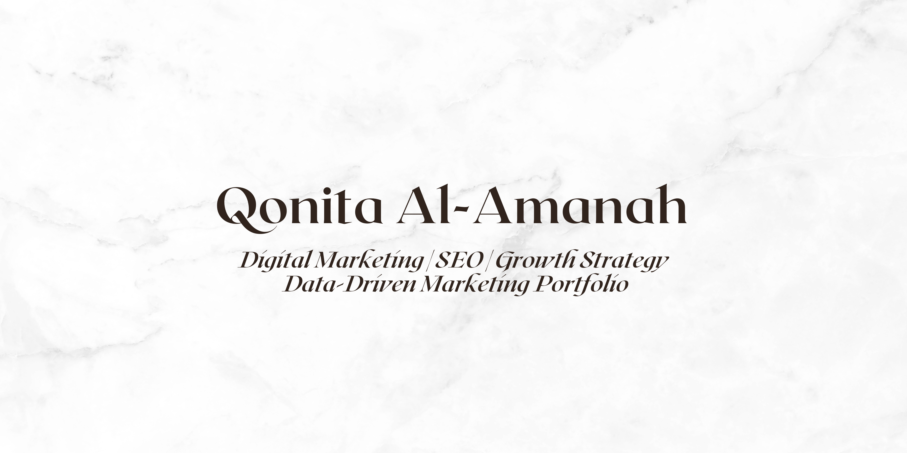

  

<h3 align="center">Digital Marketing Enthusiast | SEO & Data-Driven Strategy</h3>

Turning insights into growth 🚀  
Building strategies based on data, not guesswork.

---

## 🌱 About Me

I'm passionate about digital marketing, website optimization, and performance analysis.  
I focus on creating strategies that are measurable, scalable, and impactful.

I believe marketing should be:
- Creative but strategic  
- Data-driven, not assumption-driven  
- Focused on long-term growth  

---

## Tools & Platforms

  
  
  
  
  

---

## 📊 Featured Projects

Here you'll find:
-  SEO Audit Samples  
-  Social Media Strategy Plans  
-  Website Optimization Projects  
-  Campaign Performance Reports  
-  Marketing Experiments & Mini Analysis  

More projects coming soon as I continue building and learning 

---

## 📌 Current Focus

- Improving SEO analysis skills  
- Learning more about web performance  
- Exploring automation for marketing tasks
- Analyzing social media 

---

## 📫 Let's Connect

Feel free to connect with me for collaboration or discussion about digital marketing & growth strategy!

LinkedIn: www.linkedin.com/in/qonita-al-amanah-b0b21b126  
Email: qonitaalamanah@gmail.com
WhatsApp: +62-857-9505-0487

---

 Always learning. Always optimizing. Always growing.

---

##  GitHub Statistics

  
  

